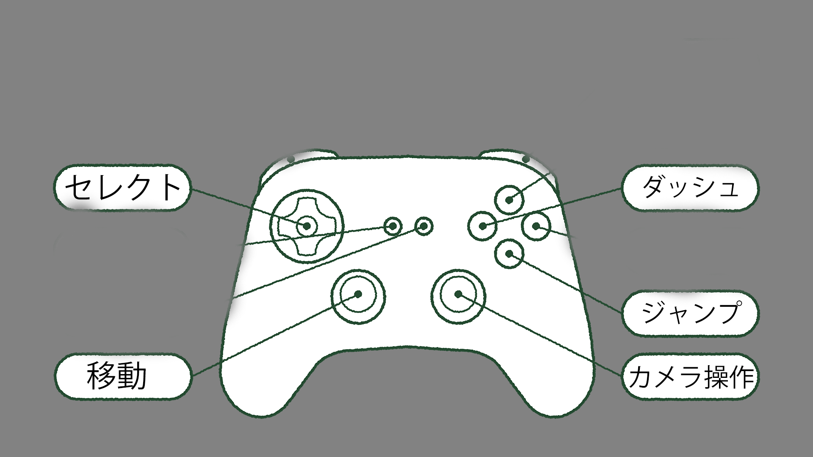
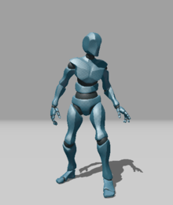
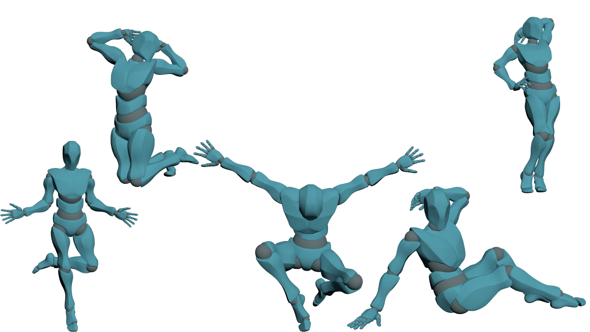
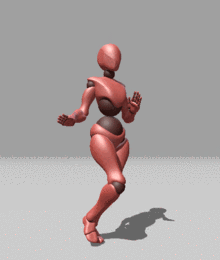
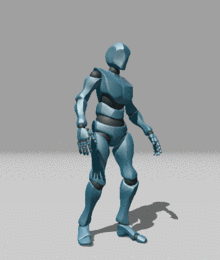
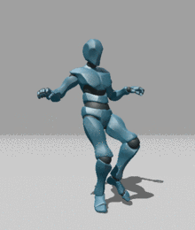
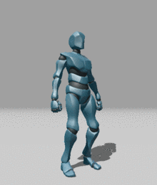

# Running_man
## 目次
-[Running_man](#Running_man)  

- [Running\_man](#running_man)
  - [目次](#目次)
  - [自己紹介](#自己紹介)
  - [ゲーム概要](#ゲーム概要)
  - [操作説明](#操作説明)
  - [制作経緯](#制作経緯)
  - [デザイン](#デザイン)
  - [引用元](#引用元)
     
  
## 自己紹介  
  **重永 翔**  
  
**使用できるプログラミング言語**
* C++
* C
* Java  

**少し使用できる言語**
* HTML
* Java script
* CSS

**好きなゲームジャンル**
  * レースゲーム
  * バカゲー
  * オープンワールド
  
**最近ハマっているゲーム**
  * グランツーリスモ7
  * Forza Horaizon5
  * アイドルマスターシンデレラガールズスターライトステージ
　　　　　　　　　　　　　　　　　　　　　　　　　　　　等々

## ゲーム概要
キャラクターを操作してゴールまでたどり着くゲーム  
▼紹介動画　　
<iframe width="885" height="498" src="https://www.youtube.com/embed/HyL_lRrL9SU" title="Running man" frameborder="0" allow="accelerometer; autoplay; clipboard-write; encrypted-media; gyroscope; picture-in-picture; web-share" allowfullscreen></iframe>  

* ジャンル  
    3Dアクション  

* 制作エンジン  
    学校内製エンジンを使用  

* 開発環境  
    Windows11  
    DirectX  

## 操作説明
  

##  制作経緯  
自分の好きなゲームのジャンルの中にバカゲー、があり、昔からよくプレイをしていました。その中にSteamで購入したが、今の環境ではプレイできないゲームがあました。どうすればいいかを考えていた際、できないなら作れば良いと思い、このおゲームの制作を始めました。 
  
## デザイン
このゲームの一番のこだわり、それがいかにバカっぽく、変に見せれるか  
  
* ### キャラクターモデル  
~~複雑なモデル~~  
**シンプルなモデル**  
  
　　　　　　　　　　　Y BOT  

* ### メニュー画面  
キャラクターに変なポーズをさせることで独特の雰囲気を醸し出せる。  
ポーズは全5種類
  

* ### キャラクターアニメーション  
普通のDashやWalk、Jumpではそれはただのアクションゲームでありバカゲーでは無い。
ただ、モデルとしたゲームでは、普通の動きだったためさらに別のゲームを検索。
そして別のゲームの動きに近いアニメーションを検索。(そのゲームにはダッシュのジャンプのみ存在)
* Dash  
  
  
* Jump  
  
  
ただ、参考ゲームにはWalkとIdolのモーションは存在しなかったため、雰囲気の似たモーションを用意  
  
* Walk  
  
  
* Idol  
  
  
## 引用元
**ゲームのモデル**
